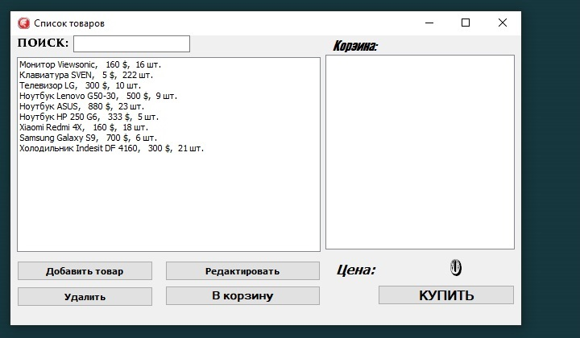
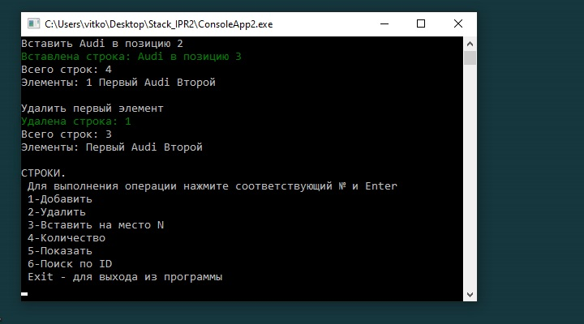
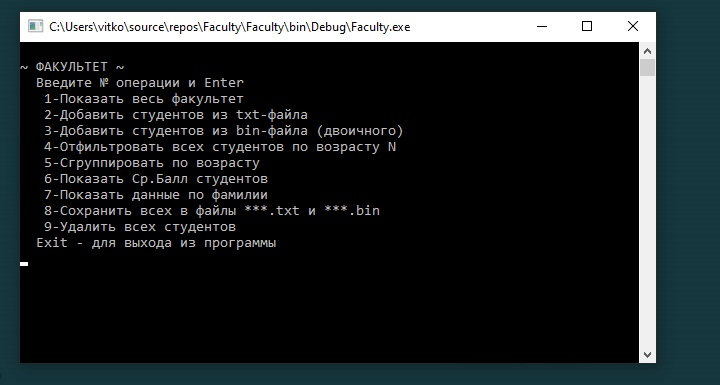

# CSharp_Lab
 my BSUIR labs. Language: C#

# _[ИПР_1]_

Разработать приложение в среде программирования Delphi, используя объектно-ориентированный подход: 

- **a.** предусмотреть необходимый набор классов для описания предметной области; 
- **b.** предусмотреть необходимый набор методов, свойств и полей в проектируемых классах; 
- **c.** предусмотреть возможности тестирования созданных классов. 

Вариант 1 Класс для представления списка товаров. Товар характеризуется уникальным названием, количеством единиц, ценой. Реализовать методы для добавления и редактирования товаров, поиска товаров, «покупки» товара.

# _[ИПР_2]_ 
Цели работы:
1.	Изучить понятие класса в языке C#.
2.	Изучить использование элементов класса   полей, методов, свойств, констант.
3.	Изучить понятие статического элемента и статического класса.
4.	Изучить синтаксис расширяемых методов.
5.	Изучить понятия делегата и λ-выражения.
6.	Изучить понятие исключительной ситуации.
7.	Получить представление о пространствах имен в среде .Net Framework.

В задании необходимо реализовать класс согласно указанному варианту. Предусмотреть необходимый набор методов, свойств и индексаторов в реализуемых классах. Изучить статические классы и статические элементы класса. Расширить созданные ранее классы статическими элементами (например, для работы с уникальным числовым идентификатором объекта) и методами расширения. Расширить классы событиями. Предусмотреть возможность генерирования исключительных ситуаций (как системных, так и пользовательских). Создать собственные пространства имен, в которые поместить написанные классы. 

Вариант 1 Стек для хранения строк.

# _[ИПР_3]_ 
Необходимо создать классы для представления объектов, описанных ниже. Подразумевается использование в этих классах вложенных коллекций объектов. Для вложенных коллекций использовать стандартные или самостоятельные типы-коллекции (список, словарь, множество и т.п.). Обеспечить реализацию интерфейса `IEnumerable<T>` для коллекций. 
Продемонстрировать возможности LINQ to Objects для
- фильтрации коллекции;
- проекции коллекции;
- группировки элементов коллекции;
- преобразования коллекции;
- вычисления агрегатных функций.   

Реализовать методы, позволяющие сохранять и читать данные объектов класса-коллекции из текстового и двоичного файла.

Варианты заданий (любой на ваше усмотрение). 
**_Факультет_** объединяет студенческие **_группы_**, а **_группа_ – _студентов_**.

# _[ИПР_4]_ 
Создать среду для моделирования полетов самолетов. Отдельный объект – **_самолет_** – обладает такими характеристиками как скорость, высота, направление полета. Программа полета для каждого самолета храниться в отдельном текстовом файле. Формат файла следующий – каждая строка содержит относительное время полета, высоту и точку курса для указанного времени. Среда моделирования позволяет «запустить» самолет, указанный пользователем, с соответствующей программой полета. Среда моделирования также отображает текущие данные запущенных самолетов.

# _[ИПР_5]_ 
Разработать функциональные требования к выбранному Проекту определить список возможностей, которые будут реализованы приложением.
Разработать общую архитектуру Проекта.
Создать слой доступа к данным, используя в качестве хранилищ тек-стовые или двоичные файлы, XML (на выбор).
Создать слой бизнес-логики.
Используя стандартные элементы управления WPF и контейнеры компоновки создать окно (окна) для Проекта.
Реализовать привязку данных к элементам интерфейса.
Создать оригинальный визуальный стиль окна и некоторых элементов управления.
Разработать несколько (минимум 2) шаблонов для элементов управления и данных. Вариант 1 Картотека электронных книг. UPDATE!
Создать базу данных для хранения данных Проекта.
Разработать в проекте слой доступа к данным (DAL) с использованием ADO.NET. DAL должен обеспечивать основные операции с бизнес-сущностями проекта (т.е. создание, чтение, изменение, удаление). При реализации DAL можно использовать прямое чтение из базы (что предпочтительнее), либо DataSet-ы (обычные или типизированные).

[ИПР_1]: <https://github.com/Vitkof/CSharp_Labs/tree/main/Delphi_IPR1>
[ИПР_2]: <https://github.com/Vitkof/CSharp_Labs/tree/main/Stack_IPR2>
[ИПР_3]: <https://github.com/Vitkof/CSharp_Labs/tree/main/Faculty>
[ИПР_4]: <https://github.com/Vitkof/CSharp_Labs/tree/main/Boing>
[ИПР_5]: <https://github.com/Vitkof/CSharp_Labs/tree/main/EBook_IPR5>
